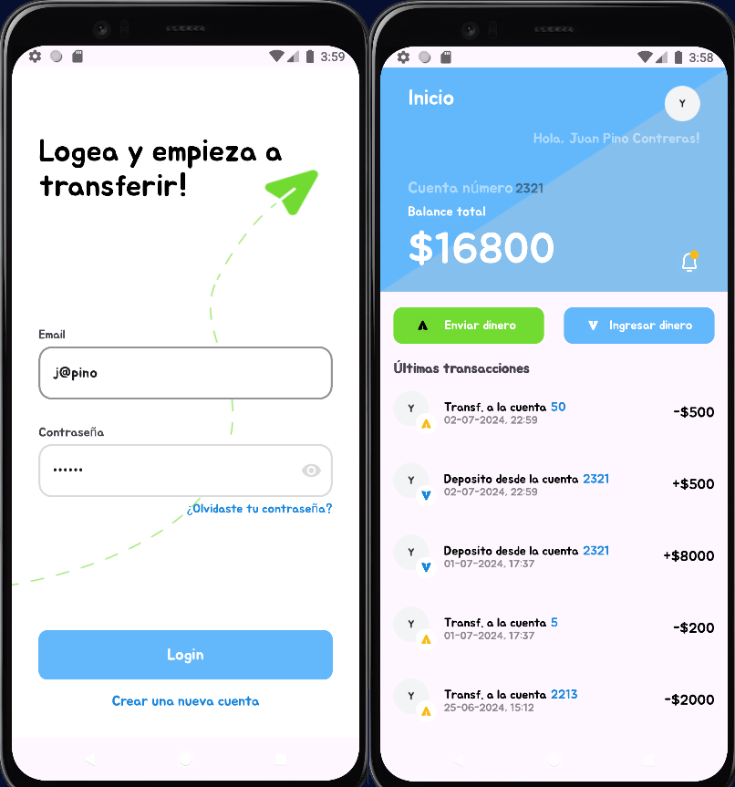

<div align="center">
  <br>
    <h2><strong>VirtualWallet</strong> </h2>
    <span>Evaluación Integradora Módulo 6-7 Api - DB - MVVM</span><br>
    <span>Juan Pino Contreras.</span>
</div>

****


## 💸 VirtualWallet

Aplicación para dispositivos Android que simula el funcionamiento de una billetera virtual. El usuario puede crear una cuenta de usuario, iniciar sesión, crear una cuenta con saldo inicial, realizar depósitos (ingreso de dinero) y enviar dinero. Por limitaciones de la API no se logra registrar transacciones recibidas desde otros usuarios, aun así, se cumple el objetivo principal del desarrollo de este proyecto que se acerca bastante al funcionamiento de una Billetera Digital actual como lo son Match, Tenpo, MercadoPago, entre otras.

En el desarrollo de este proyecto se presentaron desafíos de diferente índole, como adaptarse a la funcionalidad y métodos para obtener datos desde la API y guardarlos en una base de datos local, así como controlar el acceso a datos de las cuentas y transacciones de un usuario, estando el dispositivo con y sin conexión a internet. La arquitectura Clean y MVVM sirvió de mucho al momento de saber dónde hacer modificaciones o implementar funcionalidades para lograr cumplir con una funcionalidad fluida y coherente, así como resolver errores y ordenar la lógica de negocio plasmada en una app.


### Datos de ejemplo
| Usuario 1                      | Usuario 2                          |
|--------------------------------|------------------------------------|
| **Correo:** j@pino             | **Correo:** patymaldonado@example.com |
| **Contraseña:** 123123         | **Contraseña:** 123123             |
| **User id:** 3556              | **User id:** 3367                  |
| **Account id:** 2321           | **Account id:** 2204               |

> [!IMPORTANT]
>- **El desarrollo de este proyecto se adapta a la funcionalidad con la API para que sea fluida y complementaria a esta** 
>- Las funcionalidades que permiten crear nuevos usuarios y nuevas cuentas, y realizar transacciones, se pueden utilizar sólo logrando una conexión a la API, por lo que se debe tener conexión a internet.

> [!TIP]
>- La base de datos local se puebla desde la API, por tanto un nuevo usuario debe iniciar sesión por medio de la API para que se obtengan los datos y se guarden en la base de datos local.

## 🛠️ Tecnologías y Herramientas Utilizadas
- Android Studio Jellyfish | 2023.3.1
- Emulador: Pixel 4 XL API 30
- Swagger
- Postman
- Logcat

### Gradle
- Dependencias:
  - **ViewModel**: Gestión del estado y datos del UI, manteniendo el ciclo de vida de la actividad.
  - **LiveData**: Observación de datos para actualizaciones en la UI.
  - **Navigation**: Gestión de fragmentos y transiciones.
  - **Retrofit**: Cliente HTTP para peticiones HTTP a servicios.
  - **Gson**: Librería de Google para serializar y deserializar objetos JSON.
  - **Room**: Biblioteca que proporciona capa de abstracción sobre SQLite para acceso a la base de datos.
  - **bcrypt**: Implementación del algoritmo de hash BCrypt para la seguridad de contraseñas.
  - **JUnit**: Framework de pruebas unitarias y tests automatizados.

### Componentes de UI
- **RecyclerView**: Para la lista de transacciones y usuarios.
- **Adapter.ViewHolder**: Utilizado en conjunto con RecyclerView para mejorar la eficiencia del manejo de vistas.

## 📚 Estructura del Proyecto

El proyecto está estructurado siguiendo la arquitectura Clean y MVVM:

1. **Model**: Define los datos de la aplicación. En este desarrollo se implementan las clases `DAO` para la base de datos y clases `ApiService` para el enrutamiento a los endpoints de la API. Se definen las ***entities*** `Accounts`, `Transactions` y `Users` y las ***apiEntities*** como `LoginRequest`, `LoginResponse`, `AccountRequest` y `TransactionResponse` entre otras.
2. **View**: La interfaz de usuario que incluye fragmentos y actividades como `HomePage`, `Login`, y `TransactionSend`. También se define el `adapter` junto a su `ViewHolder` para el `RecyclerView` de las transacciones.
3. **ViewModel**: Maneja la lógica de la interfaz de usuario y comunica entre el Modelo y la Vista. Se definen los ***ViewModels*** con sus respectivos ***Factory*** `UsersViewModel`, `AccountsViewModel` y `TransactionsViewModel` que contienen los ***LiveData*** y métodos para comunicar los datos del model a la vista.

### Ejemplo de Código

#### Feature - Login de usuario

```kotlin
class UsersViewModel(private val usersUseCase: UsersUseCase) : ViewModel() {
    fun loginUser(email: String, password: String) {
        viewModelScope.launch {
            try {
                val loginFromApi = try { //Login desde la api
                    usersUseCase.loginUser(LoginRequest(email, password))
                } catch (e: Exception) {
                    null
                }
                if (loginFromApi != null && loginFromApi.isSuccessful) {
                    _loginLD.postValue(Result.success(loginFromApi))
                } else { //Login desde la db
                    val loginFromDb = usersUseCase.loginUserFromDb(email, password)
                    if (loginFromDb.isSuccessful) {
                        _loginLD.postValue(Result.success(loginFromDb))
                    } else {
                        _loginLD.postValue(Result.failure(Exception("Error al obtener usuario")))
                    }
                }
            } catch (e: Exception) {
                _loginLD.postValue(Result.failure(e))
            }
        }
    }
}
```

```kotlin
class UsersRepositoryImpl(private val userService: UserApiService, private val userDao: UserDao) : UsersRepository {
    // Login desde Api
    override suspend fun loginUser(loginRequest: LoginRequest): Response<LoginResponse> {
        return withContext(Dispatchers.IO) {
            userService.loginUser(loginRequest)
        }
    }

    // Login desde db
    override suspend fun loginUserFromDb(email: String, password: String): Response<LoginResponse> {
        return withContext(Dispatchers.IO) {
            val user = userDao.getUserByEmail(email) // Buscamos usuario por correo
            user?.let { userDb -> // Del usuario encontrado comparamos la contraseña encriptada
                val result = BCrypt.verifyer().verify(password.toCharArray(), userDb.password)
                if (result.verified) {
                    // Respondemos con un token hardcodeado y la id del usuario encontrado
                    val loginResponse = LoginResponse("TokenDB", userDb.id)
                    Response.success(loginResponse)
                } else {
                    Response.error( // Si falla enviamos un código 401 para manejarlo como error
                        401,
                        ResponseBody.create(MediaType.parse("text/plain"), "Contraseña incorrecta")
                    )
                }
            } ?: Response.error(
                401,
                ResponseBody.create(
                    MediaType.parse("text/plain"),
                    "No existe usuario con ese correo"
                )
            )
        }
    }
}
```

## 📃Conclusiones
Se destaca la importancia de la arquitectura MVVM y cómo ayuda a manejar de manera eficiente la lógica de negocio y la interfaz de usuario en aplicaciones complejas. Además, se presenta el uso de componentes esenciales de Android como ViewModel, LiveData y RecyclerView para crear una aplicación robusta y escalable. La implementación de `Retrofit` para la conexión a la API y `Room` para la base de datos simplifica las operaciones que conllevan el manejo de ambas opciones.


## 🔩 Requisitos

1. **Configuración del Entorno**:
   *Java Development Kit (JDK)*
    - Android Studio requiere el JDK para compilar y ejecutar aplicaciones. Asegúrate de tener instalada una versión compatible del JDK

2. **Descarga y Clonación**:
   - Clona este repositorio en tu máquina local utilizando Git:
     ```bash
     git clone https://github.com/Jvbass/VirtualWalletApiDB
     ```
3. **Android Studio**
    - Debes tener instalado Android Studio en tu sistema. Descargalo y abre el proyecto navegando a la carpeta donde lo clonaste.
4. **Depedencias**
  - Las dependencias estan incluidas en el proyecto, pero no esta demas asegurarte que todo este bien configurado en el archivo build.gradle.kts (Module:app y Project)
## 🤝 Contribuciones

¡Las contribuciones siempre son bienvenidas! Si tienes ejercicios adicionales, mejoras en las soluciones existentes o cualquier otro aporte que creas que pueda beneficiar a otros usuarios, no dudes en abrir un [_pull request_](https://github.com/Jvbass/VirtualWalletApiDB/pulls) o contactarme.

#### _Gracias por tu interés en este proyecto. Si tienes algun comentario o duda sobre este o cualquier otro proyecto no dudes en contactarme._
###### ¡Espero tus _PR_!👋
